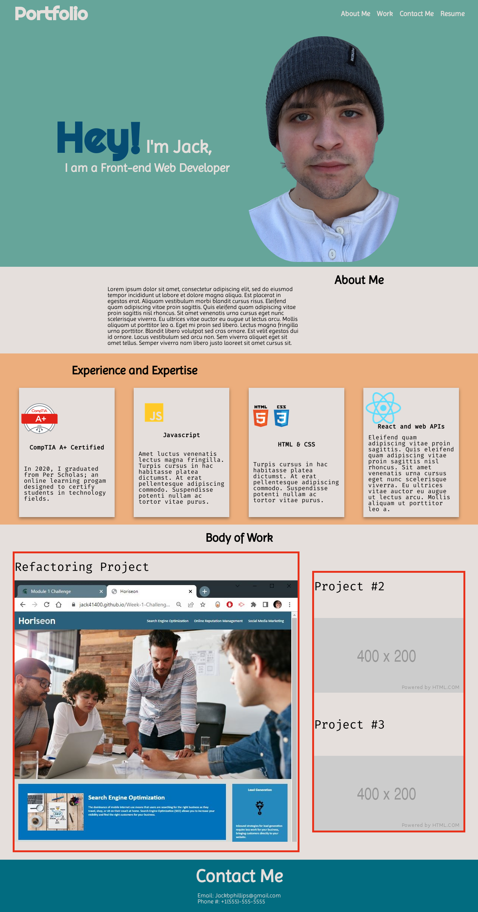
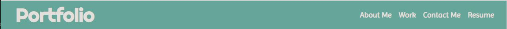
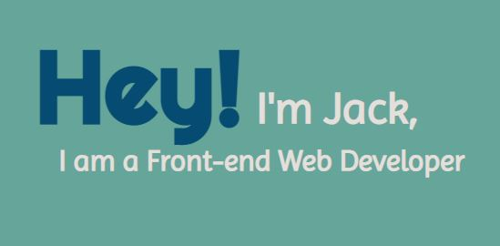
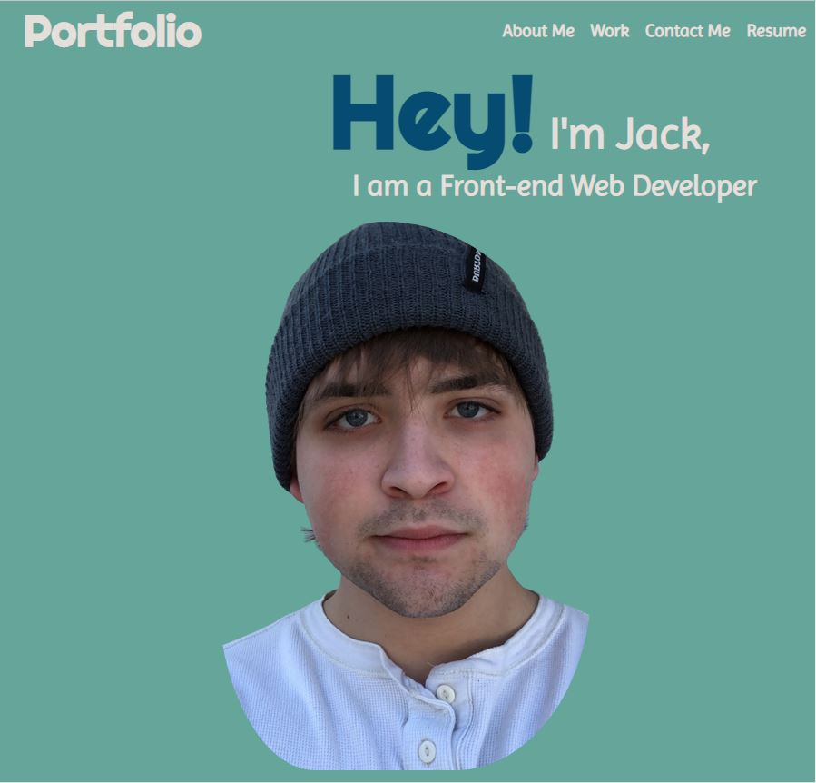

# Portfolio Project

## Description

This project was given as homework by MSU's coding bootcamp. The goal was to create a simple portfolio webpage using HTML and CSS. No starter code was included.

This project is currently deployed using Github pages at [https://jack41400.github.io/Jack-Phillips-CSS-Portfolio/](https://jack41400.github.io/Jack-Phillips-CSS-Portfolio/)

or clone the repository [here](https://github.com/Jack41400/Jack-Phillips-CSS-Portfolio.git)

## Table of contents

* [Description](#description)
* [Getting Started](#getting-started)
 - [Prerequisites](#prerequisites)
    - [Installing](#installing)
* [Objectives](#objectives)
* [Summary](#summary)
* [Usage](#usage)
    -[Full Walkthrough](#full-walkthrough)
* [What I learned](#what-i-learned)
* [Credits](#credits)

## Getting Started

### Prerequisites

Besides a simple text editor to view the code. There are no specific requirements to view this project.

### Installing

You can download the zip or clone a copy of [this](https://github.com/Jack41400/Jack-Phillips-CSS-Portfolio.git) repository, or just follow the deployed Github Pages link [Here](https://jack41400.github.io/Jack-Phillips-CSS-Portfolio/)

## Objectives
 
 - Include Name, Recent Photo, About, Body of Work, Contact on webpage
 - Link navigation scrolls to correct section
 - Body of Work shows titled images of applications
 - First application is larger in size than others
 - Application images link to deployed application
 - Screen layout adapts to viewport

## Summary

Starting off I used pintrest to collect some ideas on portfolio webpages. I also tried to find good font combinations and a color pallet. I also drew out a rough sketch on paper. I did make a few changes.

I started off working on the header. At this point I did not understand the flex properites too well. I could probably go back in and do some updating but I got it looking the way I wanted it to.

I took a long time getting this text to sit the way I wanted. This is another element I could do some cleaning up on but I got it to look how I wanted. on a screen width of 1225px or less the text wraps above the Recent Photo.

## What I learned

After completing the project my understanding of the display flex properties increased dramatically. I also have a good grasp on the @media querey now.

## Credits

All assets for this projects were provided by Trilogy Education Services

© 2022 Trilogy Education Services, LLC, a 2U, Inc. brand. Confidential and Proprietary. All Rights Reserved.

Thanks to [Image resizer](https://imageresizer.com)
